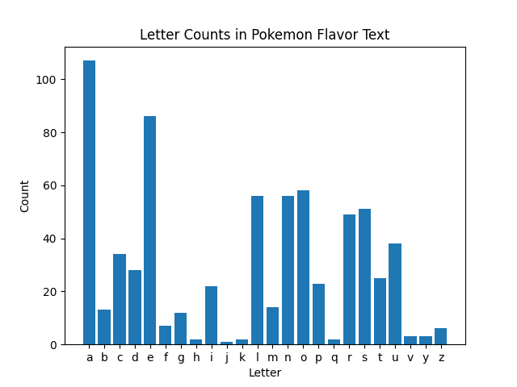

# Project Title

## 1. Goals for Your Project (10 points)

- **Goal 1:** Do a basic spanish language analysis of vowel frequency in 2 completely different texts.
- **Goal 2:** Demonstrate a holistic understanding of the SI 206 curriculum by completing a project that integrates the
  skills learned in the course.

## 2. Goals that Were Achieved (10 points)

- **Achieved Goal 1:** Discovered that the letter "a" is the most common vowel in both texts, as is the letter "e".
- **Achieved Goal 2:** The letter a is actually the most common letter in both texts.

## 3. Problems that You Faced (10 points)

- **Problem 1:** The hardest part about the project was probably figuring out how to limit the results from the API
  response, since the endpoint wasn't paginated.

## 5. Visualization that You Created (10 points)


Number of vowels in the Spanish flavor text of each Pokemon in the Pokedex.

Number of vowels in the Spanish text of the Copa 2024 Final article.


Complete letter frequency of the Spanish flavor text of each Pokemon in the Pokedex.

Complete letter frequency of the Spanish text of the Copa 2024 Final article.

The graphs in both examples are pretty similar, indicating the same distribution of vowels and letters in both texts.
One can assume that this is due to the fact that both texts are in Spanish, and the language has a consistent
distribution

## 6. Instructions for Running Your Code (10 points)

### Prerequisites

Ensure you have Python installed on your system. You can download it
from [python.org](https://www.python.org/downloads/).

### Setting Up the Environment

1. **Clone the Repository:**

   ```sh
   git clone https://github.com/chriszhang08/si206final.git
   cd your-repository
   ```

2. **Set up your IDE:**

   This really depends on your IDE of choice, but happy to help out during office hours :)


3. **Install Dependencies:**

   Use `pip` to install the required packages from `requirements.txt`:

   ```sh
   pip install -r requirements.txt
   ```

## 7. Documentation for Each Function (20 points)

### Function; `fill_pokedex`

- **Input:** pokeapi endpoint https://pokeapi.co/api/v2/pokedex/1
- **Output:** a 2d array of Pokemon from the endpoint, grouped into groups of 25

Sample output:\
[\
[Pokemon1, Pokemon2, ..., Pokemon25],\
[Pokemon26, Pokemon27, ..., Pokemon50],\
...\
]

### Function: `pokedex_query`

- **Input:** a list of Pokemon unique ids
- **Output:** the Spanish flavor text of each Pokemon

This function queries the local SQLite database for the existing API endpoint associated with each Pokemon.
The function then searches for the Spanish flavor text of each Pokemon in the input list, and inserts it to the
database.

### Table: `pokdex`

| Pokemon_ID (pk) | Name      | Pokemon URL                                  |
|-----------------|-----------|----------------------------------------------|
| 1               | Bulbasaur | https://pokeapi.co/api/v2/pokemon-species/1/ |
| 2               | Ivysaur   | https://pokeapi.co/api/v2/pokemon-species/2/ |
| 3               | Venusaur  | https://pokeapi.co/api/v2/pokemon-species/3/ |
| ...             | ...       | ...                                          |

### Table: `starters`

| Pokemon_ID (pk) | Name      | Flavor Text (ES)                     |
|-----------------|-----------|--------------------------------------|
| 1               | Bulbasaur | Una rara semilla le fue plantada ... |
| 2               | Ivysaur   | Este Pokémon tiene un bulbo en ...   |
| 3               | Venusaur  | Llena su cuerpo de energía con ...   |
| ...             | ...       | ...                                  |

### Table: `bagofwords`

| word (pk) | count | 
|-----------|-------|
| de        | 127   | 
| Colombia  | 10    | 
| Messi     | 5     | 
| ...       | ...   | 

## 8. Resources Used (20 points)

- **Resource 1:** [PokeAPI](https://pokeapi.co/)
- **Resource 3:** [BeautifulSoup Source Article (Copa 2024 Final)](https://www.bbc.com/mundo/articles/c0w4q32wzvpo)